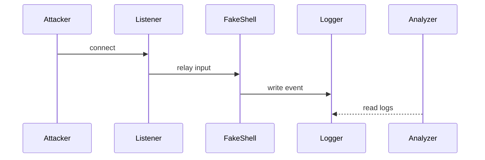

# Architecture

The system is split into clear pieces to keep risk low and analysis easy. A listener accepts incoming SSH connections and hands control to a fake shell. The shell pretends to execute but simply records inputs. A logger writes each event to JSON Lines for later study. An analyser will parse logs and a dashboard can display trends.

<!-- codex:start:sequence -->

<!-- codex:end:sequence -->
